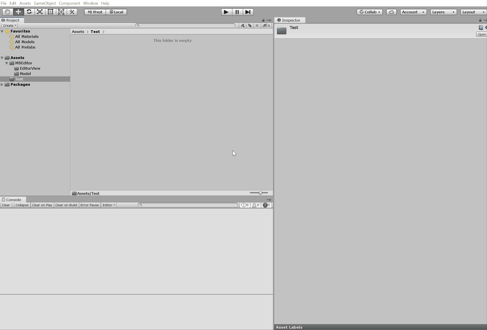

# MB2Editor
<!-- ALL-CONTRIBUTORS-BADGE:START - Do not remove or modify this section -->

<!-- ALL-CONTRIBUTORS-BADGE:END -->
A **community**, **open-source**, **Unity3D based** Mount &amp; Blade II : Banner Lord module Editor

# Feature list
- module data visual editor (**WIP**)
- drag/drop modify tool
- character/item/model preview
- troop tree preview
- build pipline (build/debug/deployment)

# Preview
## Module Data Editor (Character)

## Contributors ✨

Thanks goes to these wonderful people ([emoji key](https://allcontributors.org/docs/en/emoji-key)):

<!-- ALL-CONTRIBUTORS-LIST:START - Do not remove or modify this section -->
<!-- prettier-ignore-start -->
<!-- markdownlint-disable -->
<table>
  <tr>
    <td align="center"><a href="http://oliverwu.georgetown.domains/"> <b>Wu Zhuoran</b></a> <a href="https://github.com/YiGu-Studio/MB2CommunityEditor/commits?author=WuZhuoran" title="Code">💻</a></td>
    <td align="center"><a href="https://github.com/hx8888979"> <b>hx8888979</b></a> <a href="https://github.com/YiGu-Studio/MB2CommunityEditor/commits?author=hx8888979" title="Code">💻</a></td>
  </tr>
</table>

<!-- markdownlint-enable -->
<!-- prettier-ignore-end -->
<!-- ALL-CONTRIBUTORS-LIST:END -->

This project follows the [all-contributors](https://github.com/all-contributors/all-contributors) specification. Contributions of any kind welcome!